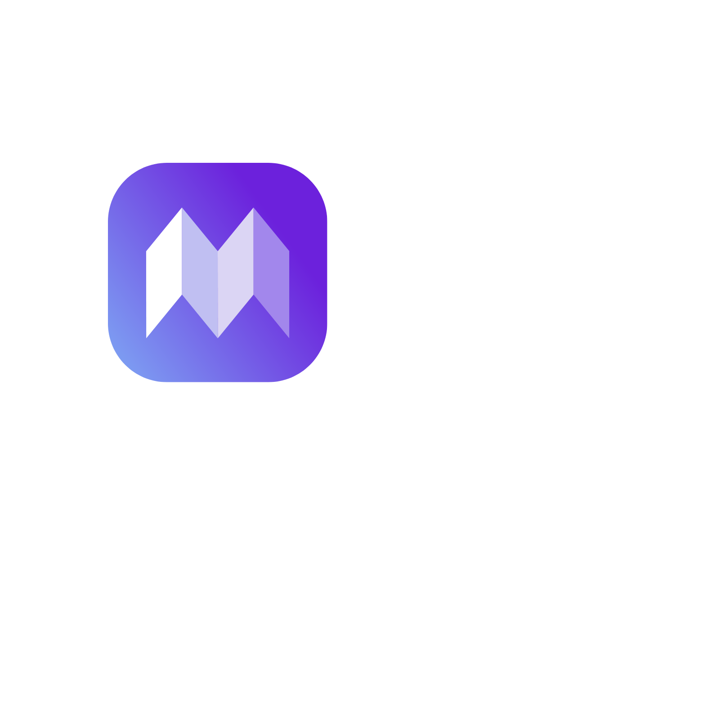

# Tlers:  The All-in-One Solution for Effortless Translation and Proofreading

Tired of juggling multiple tools for translation and proofreading? Introducing Tlers, the revolutionary online platform that streamlines your workflow and elevates your communication game. Tlers goes beyond the limitations of traditional translation software, offering a comprehensive solution that ensures both accuracy and flawless presentation in your translated text.

## Breakthrough Innovation in Translation Technology

Unlike other translation services that focus solely on converting languages, Tlers takes it a step further. We leverage cutting-edge machine learning algorithms, specifically Claude API, to deliver:

### Unmatched Accuracy

Tlers utilizes a sophisticated neural network architecture to produce natural-sounding translations that capture the nuance and meaning of the original text. Say goodbye to clunky and unnatural word choices that plague some translation services.

### Built-in Proofreading Power

Tlers integrates seamlessly with advanced grammar and style checking functionalities powered by Claude API. While it translates, it acts as your virtual editor, identifying and suggesting corrections for grammatical errors, typos, and awkward phrasing.

### Effortless Workflow for Enhanced Efficiency

Tlers is designed to simplify your translation process and save you valuable time. Our user-friendly interface eliminates the need for complex configurations or cumbersome workflows. Here's how it works:

1. **Paste Your Text**: Simply copy and paste your text into the designated field within the Tlers web application.
2. **Choose Your Target Language**: From a comprehensive list of supported languages, select the language you wish to translate your text into.
3. **Let Tlers Work Its Magic**: Click the "Translate" button, and in seconds, Tlers delivers a flawlessly translated and proofread version of your text.
4. **Review and Refine (Optional)**: While Tlers excels at accuracy and style, you can further customize the translated text to perfectly match your specific needs.

## Translation Process Overview

Tlers streamlines the translation process into three seamless steps:

1. **Translation**: Once the user inputs the text and selects the target language, Tlers utilizes Claude API to translate the text accurately.

2. **Proofreading**: As the translation is being generated, Tlers concurrently performs proofreading tasks, ensuring grammatical correctness and stylistic enhancements.

3. **Grammar Checking**: Tlers employs Claude API's grammar checking capabilities to refine the translated text, identifying and rectifying any grammatical errors.

## How Tlers Translates Your Text

Tlers employs state-of-the-art translation techniques powered by Claude API to ensure accurate and fluent translations:

- **Text Preprocessing**: Before translation, Tlers preprocesses the input text to identify its linguistic characteristics, such as language variety and style, to optimize the translation process.
  
- **Neural Machine Translation**: Tlers utilizes advanced neural machine translation models to generate translations that retain the meaning, context, and tone of the original text.

- **Contextual Understanding**: Tlers leverages context-aware algorithms to better understand the semantics and nuances of the input text, resulting in more accurate translations.

## Industrial Applications

Tlers can revolutionize communication and translation processes across various industries:

### E-commerce

In the e-commerce industry, Tlers can facilitate seamless communication with international customers. From product descriptions to customer support messages, Tlers ensures accurate translations, helping businesses expand their global reach.

### Marketing and Advertising

For marketing campaigns and advertising materials, conveying the right message in multiple languages is crucial. Tlers enables marketers to translate content accurately while maintaining brand voice and style, ensuring effective communication with diverse audiences.

### Manufacturing and Supply Chain

In manufacturing and supply chain management, clear communication is essential for coordinating operations across global teams and partners. Tlers streamlines translation workflows, enabling efficient communication and collaboration, ultimately improving productivity and reducing errors.

### Healthcare

In the healthcare sector, accurate translation of medical documents, patient records, and communication with multilingual patients is paramount. Tlers provides reliable translation and proofreading services, ensuring effective communication and compliance with regulatory requirements.

### Legal and Financial Services

In legal and financial services, precision and clarity are non-negotiable. Tlers offers accurate translation and proofreading of legal documents, contracts, financial reports, and other sensitive materials, helping professionals communicate effectively across language barriers while maintaining confidentiality and compliance.

### Education and Research

In educational institutions and research organizations, sharing knowledge and collaborating with international peers is essential. Tlers facilitates the translation of academic papers, research findings, and educational materials, promoting cross-cultural exchange and collaboration in academia.

### Hospitality and Tourism

In the hospitality and tourism industry, providing multilingual services and information to guests is crucial for delivering exceptional customer experiences. Tlers enables hotels, travel agencies, and tourism destinations to translate websites, booking platforms, and customer communications accurately, enhancing guest satisfaction and loyalty.

### Government and Public Sector

In government agencies and public sector organizations, clear communication with diverse constituents and stakeholders is essential for effective governance and public service delivery. Tlers helps governments translate official documents, public announcements, and outreach materials accurately, fostering inclusivity and accessibility.

## Benefits that Set Tlers Apart

- **One-Stop Translation and Proofreading**: Eliminate the need for separate translation and proofreading tools. Tlers offers an all-encompassing solution, saving you time and effort.
- **Exceptional Accuracy and Natural Language Fluency**: Experience the difference of superior translation technology that preserves the original meaning and delivers natural-sounding results.
- **Enhanced Clarity and Professionalism**: Ensure your translated text not only conveys the right message but also maintains professional and error-free language.
- **Effortless Workflow and User-Friendly Interface**: Tlers prioritizes ease of use. Our intuitive interface allows anyone, regardless of technical expertise, to translate and proofread with ease.

## Embrace Seamless Communication Across Languages

Tlers empowers you to communicate effectively with a global audience. Break down language barriers and expand your reach with confidence, knowing your message is delivered accurately and professionally.

## Getting Started with Tlers

1. Visit the Tlers website: [Replace with your website URL]
2. Explore the platform and its features.
3. Sign up for a free account to experience the basic functionalities of Tlers.
4. Upgrade to a premium plan (optional) for unlimited translations, advanced customization options, and priority support.

## Join the Tlers Community and Revolutionize Your Communication Strategy

Tlers represents the future of language translation. Start your journey to effortless communication today, and experience the power and efficiency of a truly comprehensive solution.

### Interface

